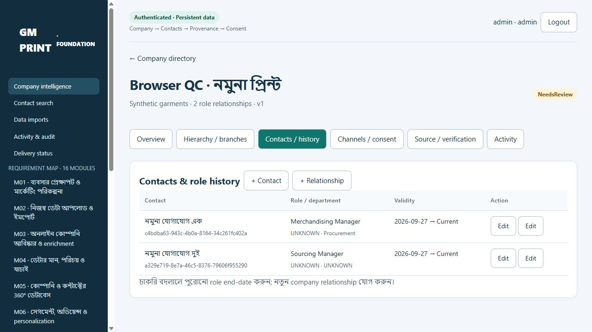
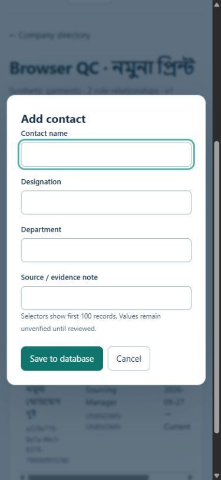
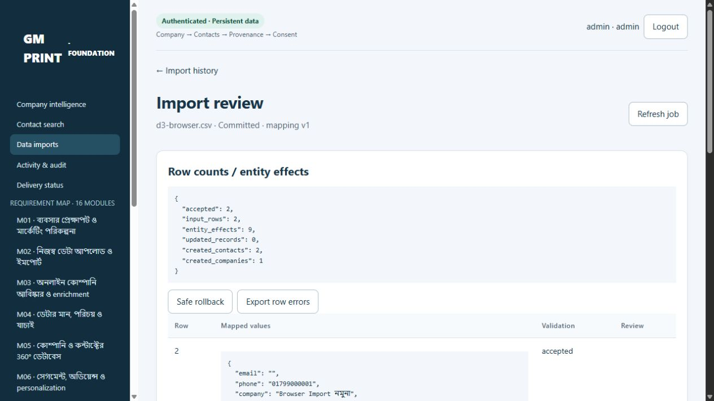
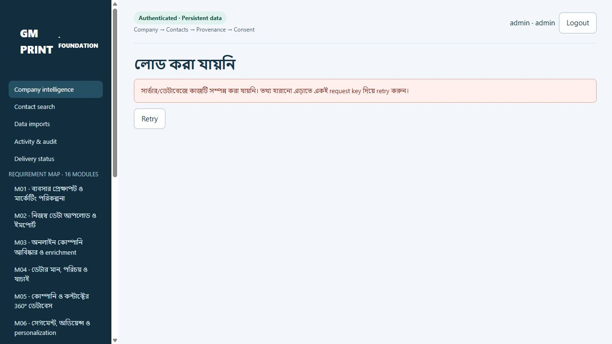

# D3 / R1a delivery evidence — 2026-09-27

Scope: local persistent Company & Contact Foundation. Not all R1/v2. No production deployment, main merge, real personal-data migration, outbound provider or ERP connection.

Preserved baseline: v1 `07efc766a13660bee8dfde5359b5f7411dc66c7f`; v2 main audited `f6a8608ee0451043020f48602ce383a0a2375307`. Local feature branch `codex/delivery-3-company-foundation` with incremental implementation commits `ddf43bc` and `30a82f5`; documentation/evidence follow separately. Browser publication can produce different GitHub commit IDs; compare final file contents, do not assume identical SHA.

## Executed environment

Windows local development; Node 24.19.0; PostgreSQL 17.11 on 127.0.0.1:55433; TypeScript 7.0.2; exact package versions/lockfile. Non-owner `gm_app` runtime and separate schema owner. Synthetic names/contacts only. Private random account/session/database credentials not included in evidence or source.

Clean-source exercise: exported committed `30a82f5` via `git archive` into a fresh ignored directory, then **npm ci**, migrations 001–003, secure seed, build, typecheck, demo QC and actual PostgreSQL/API tests against a newly created `gm_d3_clean_mujz3tul` database. All succeeded. No preexisting node_modules, schema or business data used in that exercise. This proves committed source installation; no production deployment was tested.

- `npm ci`: 222 packages installed, 0 reported vulnerabilities. ExcelJS transitive deprecated packages remain a maintenance limitation; patched uuid 11.1.1 override is pinned and XLSX behavior tested.
- `npm run typecheck`: pass.
- `npm run test:demo`: **1,051 assertions / 210 routes**, 16/64/192 preserved. These are prototype tests only.
- `npm test`: **16/16 named D3 tests**, no skipped or failed tests; clean-source run **7,925.6343 ms** overall. Small synthetic fixture suite, not a load/SLA benchmark.
- Real API server was closed/recreated during D3-02 with PostgreSQL sessions/data intact; second independent authenticated client read the same company/two contacts.
- Final review-visibility polish exposes reviewer, evidence, decision and time in the source history. Typecheck and the expanded 16/16 PostgreSQL/API suite passed again in **8,640.4308 ms** after that additive change; schema/setup remained unchanged from the clean-source run.

## Acceptance matrix

| ID | Result | Executed evidence |
|---|---|---|
| D3-01 | Pass | Original requirements untouched; 16/64/192 and Bengali text assertions; 1,051 demo checks |
| D3-02 | Pass | Committed UUID, logout/login, HTTP server restart; browser save/reload; PostgreSQL stop/start recovery |
| D3-03 | Pass | One company/two contacts; independent reader session; atomic contact+role API; browser two-contact profile |
| D3-04 | Pass | Distinct companies share email/phone; same-name company/contact enters review; canonical reviewer resolution |
| D3-05 | Pass | Company-only create/import; zero fabricated contacts/endpoints; null unknown values |
| D3-06 | Pass | CSV BOM, quoted comma/newline/escaped quote, Bengali, UTF-16; real XLSX text phone/designation/source/sheet/row; numeric warning/formula rejection |
| D3-07 | Pass | Same key concurrent commits, two worker calls, repeat file fingerprint; same key/different payload 409; row/effect counts |
| D3-08 | Pass | Role end date + new company relationship retained; invalid branch/company rejected; unknown start dates stay null |
| D3-09 | Pass | Later edit survives rollback; safe effects tombstoned, conflicts retained; opt-out remains suppressed after repeated file |
| D3-10 | Pass | Evidence required even for admin; operator review/grant denied; phone separate from WhatsApp; Unknown consent blocks |
| D3-11 | Pass | Direct reader create/edit/import/review denied; operator export denied; CSRF/Origin checks; revoked session 401 |
| D3-12 | Pass | API current/proposed conflict persisted; transaction failure rolls back; real DB outage shows retry error rather than false Saved/empty |
| D3-13 | Pass | Persisted actor/time/resource/result; runtime SQL audit UPDATE/DELETE denied; no seed secret in audit payload |
| D3-14 | Pass | Private/.env/backup/source paths denied; formula-safe export helper; actual foreign workspace UUID inaccessible |
| D3-15 | Pass | New v2 demo namespace, no v1 access/delete/migration; authenticated UI contains no fixture/sessionStorage fallback; public files secret scan |
| D3-16 | Pass (logical recovery) | Fresh committed-source install + fresh schema tests; 24-table logical backup/restore fingerprint equality and 64 evidence-file copies |

Native `pg_dump/pg_restore` test: **Not run successfully**. Windows Application Control denied execution of `pg_dump.exe`. The distinct driver-based logical recovery path passed; this does not claim a native dump pass. Production retention/encryption/HA/offsite recovery are not tested/implemented.

## Browser checks performed

Using the actual in-app browser against http://127.0.0.1:4183/workspace/:

1. Private local admin login; real PostgreSQL directory totals.
2. Created `Browser QC · নমুনা প্রিন্ট`, ID `363949b1-7b41-4a92-a639-0ab58e8b3305`; no email supplied.
3. Added two synthetic contacts with roles; reload retained both under the same company.
4. Tested contact form at 390×844: labelled inputs, focused field, contained dialog and reachable Save/Cancel; reset viewport afterward.
5. Uploaded `tests/fixtures/d3-browser.csv` through browser file chooser, confirmed auto mapping, preview and queued commit. Database worker processed batch `6e2e12e4-7ac2-4107-9962-b36119e3d052`: **2 input rows → 1 company + 2 contacts + 9 entity effects**; empty email accepted.
6. Stopped only local PostgreSQL; browser Refresh produced Bengali failure/retry. Restarted same instance; Retry returned the same Committed report and counts.

Screenshots contain synthetic data only:

## Recovery measurements

`node --env-file=.env scripts/backup-restore.mjs --logical` passed against final schema. New database `d3_restore_4ee2f43a2b7e`; **24 table fingerprints match**, including source, observations, review decisions, consent, suppression, role history, import ledger, conflicts, audit and schema checksums. **64** private uploaded/parsed evidence files copied and SHA-256 verified. Source DB was not overwritten. Session data intentionally excluded from comparison/restoration.

Ignored detailed report: `test-results/restore.json`. Private backup package: `.private/backups/d3_restore_4ee2f43a2b7e/`. These contain local account hashes/source material and must not be published. Evidence attachment bytes are copied and verified; restored source path metadata retains its original local reference, so relocation requires controlled path remapping.

## Design/implementation trace and remaining scope

| Unit | Requirement | Design/code | Validation |
|---|---|---|---|
| Relational/auth foundation | M05, M16.S1/S2/S4 | migrations, db/domain/server/setup; D3-API contract | D3-02/03/08/11/13/14 |
| Import/provenance/consent | M02.S1/S3, M04.S1/S2/S4 | parser/imports/worker; provenance, effect and consent tables | D3-04–10/12/16 |
| Incremental UI | M02/M05/M16 | ui workspace, existing styles/requirements/demo retained | browser checks, D3-01/12/15 |
| Local recovery | M16 foundation | scripts/local-db, backup-restore, exact lockfile | clean-source install + logical restore |

Remaining: R1b product/brand/ICP master, OCR/ERP import, online discovery, advanced merge/unmerge/verification, needs/products/segments; R2 real AI content/assets/approval; R3 approved channels/response/qualification/ERP acknowledgement; R4 scale/experiments. ERP DR-01, production hosting/region/budget, retention, live provider/channel and qualification decisions stay open. Source publication is not application deployment. No full module marked Done.
